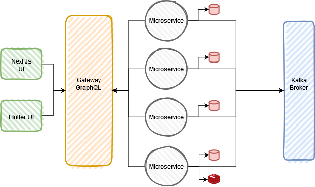

# Build Your Saas With Microservices

This is a starter template for building your saas with microservices with the next functionalities.

> gRPC - GraphQl Gateway - Clean Architecture - Docker - Kafka - Redis - Postgres

### Architecture

### Microservices

- [ ] `Authentication` - in progress
    - [x] `Sign up`
    - [ ] `Sign in`
    - [ ] `Get sessions`
    - [ ] `Revoke session`
    - [ ] `Reset password`
    - [ ] `Change password`
    - [ ] `Refresh token`
    - [ ] `Enable 2fa`
    - [ ] `Disable 2fa`
    - [ ] `Verify account`
    - [ ] `Delete account`
- [ ] `Billing`
- [ ] `Customer`
- [ ] `Notification`
- [ ] `Payments`
- [ ] `Settings`
- [ ] `Storage`
- [ ] `Tenant`
- [ ] `Profile`
    - [ ] `Get profile`
    - [ ] `Update profile`

### UI

> Next js + Tailwind css

- [ ] `web` - in progress

#### This is not the final design, nor is it my own design, but it will be something similar.

